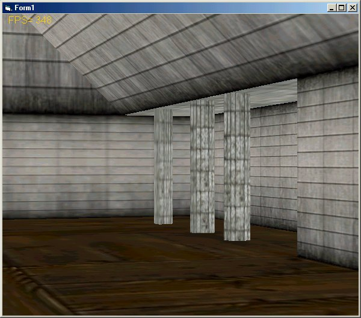



## NemoX 3d engine Collision detection Demo reupload with bugs corrected

### Description

NemoX sliding collision detection Demo

This demo shows how to perform realistic collision detection and response with polygons

the collision routines is very fast

This demo show how to build world with NemoX 3d engine

it's easy to add wall,cylinder,roof,block,cube ect..

let me know what PSC 3d people think about it
 
### More Info
 

             |
---                |---
**Submitted On**   |2002-09-25 03:53:50
**By**             |[polaris](https://github.com/Planet-Source-Code/PSCIndex/blob/master/ByAuthor/polaris.md)
**Level**          |Advanced
**User Rating**    |5.0 (20 globes from 4 users)
**Compatibility**  |VB 4\.0 \(32\-bit\), VB 5\.0, VB 6\.0
**Category**       |[DirectX](https://github.com/Planet-Source-Code/PSCIndex/blob/master/ByCategory/directx__1-44.md)
**World**          |[Visual Basic](https://github.com/Planet-Source-Code/PSCIndex/blob/master/ByWorld/visual-basic.md)
**Archive File**   |[NemoX\_3d\_e1359969252002\.zip](https://github.com/Planet-Source-Code/polaris-nemox-3d-engine-collision-detection-demo-reupload-with-bugs-corrected__1-39258/archive/master.zip)

